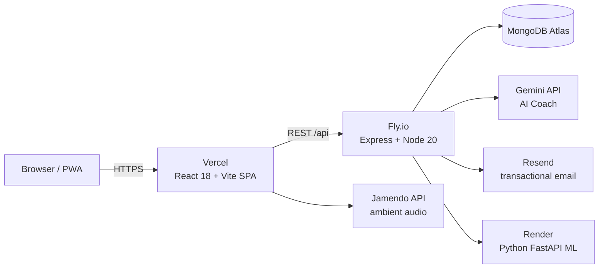

# 🌊 Breathe — Guided Breathing & Meditation PWA

[](https://github.com/SenatorBLOG/Breathe/actions/workflows/ci.yml)
[](https://breatheonline.app)
[](LICENSE)

> A full-stack breathing & meditation web app — animated breathing guide, AI coach,
> world meditation map, community, and session analytics. Solo-built and operated
> in production. No download, no signup required to start.

**Live:** [breatheonline.app](https://breatheonline.app)

---

## ✨ Features

| | |
|---|---|
| 🫁 **Breathing engine** | Animated orb guiding 6 science-backed techniques (Box, 4-7-8, Wim Hof, Coherent, Belly, Alternate Nostril) with audio fades and guidance modes |
| 🤖 **AI Coach** | Gemini-powered coach that recommends a technique from how you feel — with client-side **crisis-language detection** (EN/RU/ES) that routes to helplines instead of the LLM |
| 🗺 **Meditation Globe** | Pin where you meditate on a world map — with privacy-preserving coordinate coarsening (~1.1 km) for everyone except the pin's owner |
| 📊 **Progress analytics** | Streaks, mood before/after, calm score, charts; optional ML recommendations from a Python microservice |
| 👥 **Community** | Posts, comments, likes, reports, user blocking |
| 🌍 **i18n** | Full EN / RU / ES localization, including Unicode-aware safety patterns |
| 🔐 **Privacy & GDPR** | Data export (Art. 20), cascade account deletion (Art. 17), cookie consent, coordinate privacy |
| 📱 **PWA** | Installable, offline-capable, Lighthouse-optimized |

---

## 🏗 Architecture



- **Frontend** — React 18, TypeScript, Vite, Tailwind, framer-motion, i18next, Leaflet. Route-level code splitting + manual vendor chunks (initial JS ≈ 124 KB gzip).
- **API** — Express on Fly.io: JWT auth, per-route rate limits, helmet, express-validator, timing-equalized login, enumeration-resistant registration.
- **ML service** — Python FastAPI on Render; scikit-learn model recommending techniques from session history.
- **Data** — MongoDB Atlas via Mongoose.

Key design decisions are documented as [ADRs in `docs/adr/`](docs/adr/).

---

## 🧪 Testing & CI

```bash
# API — 27 integration tests (Jest + supertest + in-memory MongoDB)
cd api && npm test

# Frontend — 36 unit tests (Vitest)
cd frontend && npm test
```

Covered: auth flow & enumeration defenses, JWT validation, globe privacy
(coordinate coarsening, username redaction, `userId` non-leak), owner-only
deletion, SSRF allowlist, GDPR export completeness, cascade deletion with
bystander isolation, brute-force 429s, multi-script crisis detection, audio
fade race cancellation.

CI runs both suites + a production build on every push ([workflow](.github/workflows/ci.yml)).

---

## 🚀 Run Locally

Prereqs: Node 18+, a MongoDB URI (Atlas free tier works).

```bash
git clone https://github.com/SenatorBLOG/Breathe.git

# 1 — API
cd Breathe/api
npm install
# .env: MONGO_URI, JWT_SECRET (any 32+ random chars). Optional: GEMINI_API_KEY,
# RESEND_API_KEY, GOOGLE_MAPS_API_KEY — features degrade gracefully without them.
npm start                     # http://localhost:5000

# 2 — Frontend
cd ../frontend
npm install
npm run dev                   # http://localhost:3000, proxies /api to :5000
```

---

## 📁 Project Structure

```
breathe/
├── frontend/          # React SPA (Vercel)
│   ├── src/
│   │   ├── pages/           # 22 routes, all lazy-loaded
│   │   ├── components/      # BreathingCircle, AICoach/, Globe/, charts/…
│   │   ├── locales/         # en / ru / es translation.json
│   │   └── utils/           # crisisDetection, audioFade, calmScore (+tests)
│   └── vercel.json          # CSP, HSTS, cache headers, SPA rewrites
├── api/               # Express API (Fly.io)
│   ├── app.js               # app assembly (exported for supertest)
│   ├── server.js            # HTTP entrypoint
│   ├── routes/              # 15 routers: auth, globe, coach, users…
│   ├── models/              # 10 Mongoose schemas
│   ├── middleware/          # JWT auth, optionalAuth, coach rate limit
│   ├── tests/               # Jest integration suite
│   └── Dockerfile           # Fly.io deploy
├── ml/                # FastAPI + scikit-learn recommender (Render)
└── docs/
    ├── adr/                 # Architecture Decision Records
    └── DEVELOPMENT_PLAN.md  # audit + roadmap
```

---

## 🔒 Security Posture

- bcrypt (cost 12) with a **timing-equalized** "user not found" branch
- Registration never confirms whether an email exists (enumeration defense)
- Per-route rate limits (8 logins / 15 min, 6 signups / hour per IP)
- CORS pinned to production + project preview domains (no wildcard suffixes)
- SSRF hostname allowlist on the map-link resolver
- CSP, HSTS (preload), X-Frame-Options DENY, strict referrer policy
- Globe pins: coordinates coarsened to ~1.1 km and usernames reduced to an
  initial for everyone but the owner; `userId` never leaves the server

---

## 📄 License

MIT — free to use, modify and distribute.

## 🙏 Author

Built and operated by [@SenatorBLOG](https://github.com/SenatorBLOG).

<p align="center">
  <a href="https://breatheonline.app">🌊 breatheonline.app</a>
</p>
